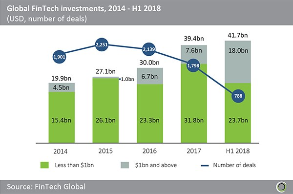
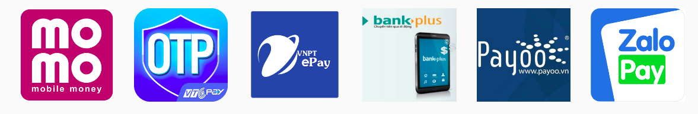

# Introduction to FinTech

    Người viết: Nguyễn Văn Tiến
    Domain: tiennv10
    Tài liệu: Tìm hiểu cuốn sách Fintech 4.0

#

Công nghệ thông tin và Internet ngày càng phát triển, đã và đang đổ bộ vào hầu hết các khu vực trên thế giới ở mọi ngóc ngách của đời sống xã hội.

Ngành tài chính-ngân hàng, một trong những ngành kinh tế hiện đại, tất nhiên cũng không nằm ngoài xu thế này. Các ứng dụng công nghệ thông tin như những con sóng mới làm thay đổi toàn bộ cách thức cung ứng và vận hành các dịch vụ tài chính đã có từ hàng trăm năm nay.

Thuật ngữ Fintech ra đời từ những con sóng đó.

    

## 1. Khái niệm

Fintech là viết tắt của từ Financial Technology (công nghệ trong tài chính), là một thuật ngữ rộng được sử dụng chung cho tất cả  các công ty sử dụng công nghệ thông tin và viễn thông để cung cấp dịch vụ tài chính. Fintech có thể được xem như là sản phẩm của cuộc cách mạng 4.0 trong hoạt động tài chính-ngân hàng. Fintech cung cấp rất nhiều sản phẩm dịch vụ thuộc về lĩnh vực tài chính như thanh toán điện tử, thanh toán trên di động, tài chính cá nhân, hay tài chính doanh nghiệp. Một số phân khúc có thể liệt kê như cho vay ngang hàng(P2P), đầu tư theo nhóm, chấm điểm tín dụng, tư vấn, gọi vốn cộng đồng, tiền kỹ thuật số. Nhu cầu sử dụng các dịch vụ của các công ty Fintech là các ngân hàng truyền thống, công ty bảo hiểm, người tiêu dùng và các doanh nghiệp.

Khác với thị trường tài chính truyền thống gồm hai đối tượng là các định chế tài chính(ngân hàng, công ty tài chính, đầu tư, bảo hiểm, chứng khoán...) và khách hàng, đối tượng của Fintech gồm 3 đối tượng tác động qua lại lẫn nhau: các định chế tài chính, các công ty finctech, khách hàng.

Về cơ bản, có thể  phân các dịch vụ mà các công ty Fintech cung ứng các loại hình dịch vụ:

- Dịch vụ tài chính (huy động vốn từ cộng đồng, tín dụng, ...).
- Quản lý tài sản (mạng xã hội đầu tư).
- Quản trị tài chính cá nhân.
- Dịch vụ đầu tư và ngân hàng.
- Dịch vụ thanh toán (biện pháp thanh toán thay thế, bảo mật).
- Dịch vụ khác (bảo hiểm, bảo lãnh, giải pháp công nghệ khác).

Các doanh nghiệp Fintech được chia thành 2 nhóm. 

- Nhóm thứ nhất là các công ty cung cấp các công cụ kỹ thuật để tạo ra các sản phẩm tài chính mới cho người dùng, bao gồm tất cả các mảng hoạt động hiện tại của ngành tài chính truyền thống gồm thanh toán, huy động vốn, cho vay, đầu tư và quản lý tài sản, bảo hiểm.

    - Trong thanh toán, Fintech cung cấp các phương thức thanh toán hiện đại như thanh toán di động, ví điện tử, chuyển tiền ngang hàng.
    - Trong huy động vốn, Fintech tạo ra sản phẩm gọi vốn trực tuyến từ cộng đồng cho phép người có dự án hay ý tưởng sản phẩm nhưng lại không có vốn để thực hiện, có thể huy động vốn từ xã hội. Hiện nay trên thị trường có các hình thức gọi vốn như: gọi vốn theo hình thức ủng hộ, theo hình thức có đãi ngộ, theo hình thức góp vốn, theo hình thức cho vay, theo hình thức phát hành tiền ảo.

    - Trong cho vay, Fintech tạo ra sản phẩm cho vay ngang hàng(P2P), dựa trên nền tảng trực tuyến để kết nối người đi vay và người cho vay.

    - Trong đầu tư quản lý tài sản, Fintech cung cấp các giải pháp tư vấn, lựa chọn hình thức và quản lý các khoản đầu tư dựa trên công nghệ thông qua mạng giao dịch xã hội và tư vấn động.

    - Trong bảo hiểm, Fintech cung cấp mô hình môi giới và mô hình công ty bảo hiểm, giúp thúc đẩy khả năng tìm kiếm các lọai hình bảo hiểm phù hợp và mang lại những giải pháp tốt hơn cho khách hàng thông qua việc sử dụng công nghệ.

- Nhóm thứ hai là nhóm cung cấp các giải pháp công nghệ và công cụ hỗ trợ mới, còn gọi là nhóm hỗ trợ. Ví dụ: công cụ bảo mật, nhận diện khách hàng, quản lý và phân tích dữ liệu, quản lý rủi ro, quản lý quan hệ khách hàng, các phần mềm quản lý cá nhân và doanh nghiệp.

    - Trên nền tảng Internet và kỹ thuật số, nhiều ứng dụng sản phẩm hay mô hình kinh doanh trong lĩnh vực tài chính - ngân hàng đã được các doanh nghiệp Fintech phát triển. Đặc biệt, với sự phát triển mạnh mẽ của các công nghệ mới như dữ liệu lớn(Big Data), trí tuệ nhân tạo(AI), Blockchain, điện thoại thông minh(Smart phone),... Fintech đang phát triển mạnh mẽ ở nhiều nước trên thế giới. Những dịch vụ tài chính dựa trên nền tảng công nghệ mang lại nhiều lợi ích, mở ra thời đại mới trong hoạt động tài chính trên thế giới: thời đại kỹ thuật số. 

## 2. Quá trình và xu hướng phát triển Fintech trên thế giới

***Quá trình phát triển của Fintech***

Fintech được bắt nguồn từ đầu những năm 1990, do Citigroup khởi sướng, được gọi là "Hiệp hội Công nghệ Dịch vụ Tài chính" với mục đích tạo điều kiện cho các hoạt động hợp tác về công nghệ. Tuy nhiên, chỉ đến năm 2014 mới thực sự thu hút được sự quan tâm của các nhà quản lý, số lượng người tham gia ngày càng đông. Các mốc phát triển chính của Fintech:

||Fintech 1.0   (1866-1967)| Fintech 2.0   (1967-2000)| Fintech 3.0   (2008-nay)
---|---|---|---
**Thành tựu công   nghệ có ảnh   hưởng đến ngành   tài chính** | -1866: cáp xuyên Đại Tây Dương   -1918: Fedwire   -1958: thẻ tín dụng ra đời   -1966: mạng lưới điện tín toàn cầu   -1967: bộ công cụ giải mã code | -1967: máy ATM đầu tiên, máy tính tài chính cầm tay   -1973: mã SWIFT   -1983: điện thoại di động, ngân hàng trực tuyến   -1990s: quản trị rủi ro định lượng/VaR   - 1999: Interner, bong bóng dot.com | -2007: Iphone ra đời   -2008: Wealthfront thành lập và cung cấp dịch vụ đầu tư trực tuyến    -2009: triển khai Bitcoin, Square ra đời cung cấp dịch vụ thanh toán qua điện thoại   -2011: dịch vụ chuyển tiền ngang cấp Transferwise ra đời
**Kết quả**| Thúc đẩy toàn cầu hóa các dịch vụ tài chính | Thúc đẩy số hóa các dịch vụ tài chính | Sự nổi lên của những công ty công nghệ sáng tạo

***Xu hướng phát triển Fintech trên thế giới***

Trong những năm gần đây, thế giới chứng kiến sự bùng nổ của hoạt động đầu tư vào lĩnh vực Fintech trên toàn cầu. Theo thống kê của Fintech Global, sự gia tăng đầu tư vào Fitech đặc biệt mạnh mẽ trong giai đoạn từ năm 2014 trở lại đây. Nếu như trong giai đoạn 2010-2013, lượng đầu tư vào Fintech giao động trong khoản 2-4 tỷ USD thì đến năm 2017, lượng đầu tư vào Fintech đã tăng lên gấp 10 lần đạt xấp xỉ 40 tỷ USD. Đáng chú ý nữa đầu năm 2018, tổng đầu tư vào Fintech trên toàn cầu đã đạt 41,7 tỷ USD, vượt con số kỷ lục đã đạt được trong cả năm 2017. Điều này cho thấy lĩnh vực này tiếp tục có sự phát triển mạnh mẽ trong thời gian tới.

Fintech thâm nhập vào  ngân hàng ở nhiều lĩnh vực, từ hoạt động cho vay, dịch vụ ngân hàng, quản trị rủi ro đến các giao dịch tần suất cao, dữ liệu lớn. Phần lớn các khoản đầu tư tập trung vào phân khúc khách hàng và doanh nghiệp vừa và nhỏ với hai lĩnh vực nổi bật là thanh toán và cho vay. Xu hướng và mức độ phát triển của Fintech tại các khu vực và trên thế giới cũng có sự khác nhau. Tuy vậy, có thể thấy rằng mặc dù ở các khu vực khác nhau với mức độ tiếp cận và chấp nhận thị trường khác nhau, nhưng không thể phủ nhận rằng Fintech đã và đang dần tạo ra những tác động rất lớn tới thị trường ngân hàng và xu hướng phát triển ngành tài chính-ngân hàng trong tương lại. Xu hướng phát triển chính của Fintech trong lĩnh vực tài chính-ngân hàng trong thời gian tới sẽ đi theo hai hướng chính:

- Thứ nhất, Fintech sẽ ngày càng thâm nhập mạnh mẽ hơn vào các lĩnh vực dịch vụ mà ngân hàng cung cấp, trong đó bên cạnh những lĩnh vực truyền thống vốn là thế mạnh của ngân hàng là thanh toán và cho vay, Fintech sẽ tiếp tục phát triển sang những lĩnh vực có nhiều tiềm năng khác như dịch vụ chuyển tiền quốc tế, cho vay ngang hàng(P2P), gọi vốn cộng đồng, ...

- Thứ hai, Fintech sẽ tiếp tục đi đầu việc ứng dụng công nghệ mới, nâng cao tiện ích cho người sử dụng cũng như mức độ bảo mật cho khách hàng. Ví dụ như, việc phát triển các công cụ tự phục vụ như Internet Banking, Mobile Banking; cung cấp các giải pháp công nghệ giúp số hóa cho ngành ngân hàng; cung cấp các giải pháp về POS thế hệ mới như POS sử dụng công nghệ giao tiếp trường gần NFC hoặc mã QR; cung cấp các giải pháp công nghệ giúp tăng cường bảo mật khách hàng từ các hoạt động gian lận, làm giả tài khoản và đánh cắp thông tin; phát triển các giải pháp thanh toán ngang hàng và ví điện tử, sử dụng công nghệ phi tiếp xúc cho ví điện tử; áp dụng rộng rãi công nghệ Blockchain ...

Như vậy, có thể nhận thấy trong những xu hướng phát triển của Fintech trong thời gian tới sẽ tiếp tục thâm nhập mạnh mẽ vào các lĩnh vực trong ngành ngân hàng. Điều này có thể tạo ra những cơ hội và thách thức đối với hệ thống ngân hàng trong quá trình phát triển dười kỹ nguyên công nghệ 4.0.

## 3. ***Những tác động của fintech***

Các ứng dụng đa dạng của Fintech đang tác động đến hầu hết mọi lĩnh vực hoạt động của ngành tài chính như tiền gửi, thanh toán, bảo hiểm, chứng khoán, tín dụng, quản trị rủi ro, không những thế Fintech cũng tác động đến cơ cấu thị trường, cơ cấu sản phẩm, chiến lược phát triển và mọi mặt kinh doanh của cả hệ thống tài chính ngân hàng. Những tác động lớn nhất có thể kể đến như:

- **Làm thay đổi kênh phân phối và các sản phẩm dịch vụ tài chính truyền thống**, đặc biệt là dịch vụ ngân hàng. Chúng ta có thể thấy rõ những tác động này qua xu thế phát triển mạnh trong những năm gần đây của các kênh bán hàng qua Internet, Mobile Banking, Tablet Banking, mạng xã hội, phát triển ngân hàng kỹ thuật số, giao dịch không giấy tờ...

- **Fintech với các ứng dụng công nghệ cao**, chẳn hạn như ứng dụng dữ liệu lớn(Big Data) sé giúp phân tích hành vi khách hàng, giúp cho các định chế tài chính thu thập dữ liệu bên trong và bên ngoài nhằm giảm chi phí, hỗ trợ các quá trình ra quyết định và nâng cao chất lượng dịch vụ, mang lại giá trị gia tăng cũng như sự hài lòng hơn cho khách hàng.

- **Xu hướng "ngân hàng không giấy", "tổ chức tài chính không giấy"** sẽ trở nên phố biến và là thách thức không nhỏ của ngành dịch vụ tài chính trong việc giảm dần vai trò của các chi nhánh. Bởi việc cạnh tranh thông qua mở rộng mạng lưới các chi nhánh sẽ chấm dứt, do chi phí hoạt động cao. Thay vào đó, cạnh tranh công nghệ tài chính hiện đại cũng dần trở nên gay gắt hơn trong các định chế tài chính.

- **Thị phần của các ngân hàng nói chung và các định chế tài chính nói riêng** có xu hướng giảm bớt, "chia phần" cho các công ty Fintech. Chẳng hạn như các ngân hàng hoàn toàn đứng ngoài cuộc trong dịch vụ tiền ảo Bitcoin, một hệ thống tiền tệ mới đang ngày càng lớn mạnh trên phạm vi toàn cầu.

- **Thị trường lao động trong lĩnh vực tài chính, ngân hàng cũng sẽ có sự thay đổi**, công nghệ có thể thay thế cho lượng lớn nhân viên của các ngân hàng, tổ chức tài chính, công ty chứng khoán, bảo hiểm... Mặc dù vậy nhu cầu về nguồn nhân lực chất lượng cao vẫn sẽ gia tăng(giỏi cả về chuyên môn nghiệp vụ và công nghệ thông tin).

Ngoài những tác động tích cực, Fintech cũng được đánh giá tiềm ẩn một số rủi ro như quá nhiều loại hình dịch vụ tài chính do Fintech mang lại hay các dịch vụ quá mới có thể khiến khách hàng bối rối và không hiểu hết các quyền hạn và nghĩa vụ của bản thân khi tham gia dịch vụ, hay Fintech cũng có thể thay thế các ngân hàng vật lý truyền thống, khiến các hộ gia đình có thu nhập thấp không thể tiếp cận với các dịch vụ tài chính... Tuy nhiên những lo ngại này là không đáng kể. Trên thực tế là sóng Fintech đã và đang tác động lên lĩnh vực dịch vụ tài chính ngày một mạnh mẽ, kéo theo đó, Fintech trở thành một trong những lĩnh vực đầu tư "nóng" nhất trên thị trường toàn cầu. 

## 4. Tình hình phát triển Fintech tại Việt Nam

Trong những năm gần đây, kinh tế Việt Nam có tốc độ tăng trưởng khá ấn tượng, số người sử dụng Internet ngày càng đông đảo. Theo thống kê mới đây, 54% dấn số Việt Nam sử dụng Internet, và dự kiến còn tăng mạnh trong những năm tới, góp phần thúc đẩy phát triển kinh tế số, trong đó có lĩnh vực Fintech.

Lĩnh vực Fintech ở Việt Nam còn khá mới mẻ dù các công ty trung gian thanh toán đã xuất hiện vào năm 2008. Hiện nay, thị trường chỉ có khoảng 40 công ty hoạt động trong các lĩnh vực khác nhau, trong đó phần lớn tập trung vào mảng thanh toán.

Cụ thể, 60% các doanh nghiệp khởi nghiệp Fintech ở Việt Nam đang cung cấp cho người tiêu dùng công cụ thanh toán trực tuyến; cung ứng giải pháp thanh toán kỹ thuật số POS/mPOS, chuyển tiền.

Nổi bật là một số cái tên như VNPT với ví điện tử MoMo và VNPT EPay, VTC có VTC Pay, Viettel có BankPlus, Payoo do VietUnion và NTT Data(Nhật Bản) thực hiện, AliPay của Alibaba, ZaloPay của VNG...

    

Ngoài ra, thị trường Fintech Việt Nam còn có một số doanh nghiệp khởi nghiệp hoạt động ở những lĩnh vực khác như gọi vốn cộng đồng, dịch vụ cho vay trực tuyến..., nhưng đều ở quy mô nhỏ. Các loại hình Fintech khác như sàn giao dịch cho vay ngang hàng, quản lý đầu tư tự động, giao dịch tiền ảo..., gần như lặng lẽ và vẫn chưa có cơ chế pháp lý tương ứng.

Nhìn chung, so với các nước trong khu vực như Singapore, HongKong hay thậm chí Campuchia thì sản phẩm Fintech ở Việt Nam còn rất khiêm tốn. Với qui mô thị trường rộng lớn, kinh tế đang đà tăng trưởng, rõ ràng Fintech Việt Nam còn rất nhiều tiềm năng khai thác.