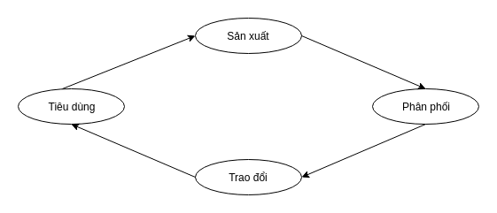
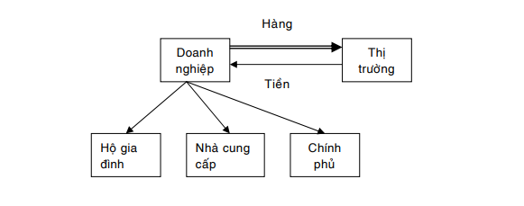
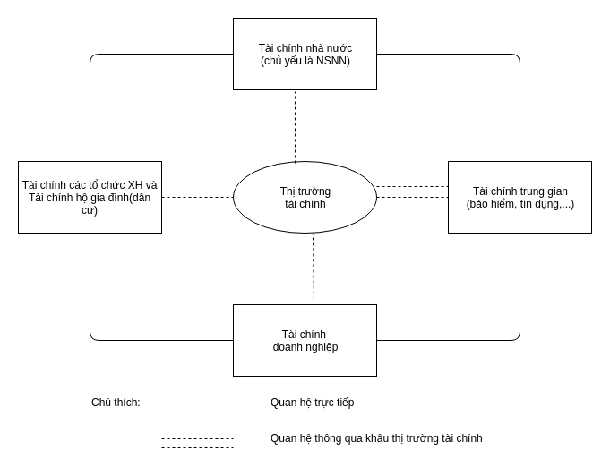

# Lý thuyết tài chính tiền tệ

    Người viết: Nguyễn Văn Tiến
    Domain: tiennv10
    Tài liệu tham khảo: Giáo trình tài chính tiền tệ 1, 2

## 1. Những lý luận cơ bản về tiền tệ

### 1.1. Sự ra đời, hình thái và bản chất của tiền tệ

"`Tiền tệ` là một phạm trù kinh tế, đồng thời cũng là phạm trù lịch sử. Sự xuất hiện của tiền tệ là một phát minh của con người trong lĩnh vực kinh tế và làm thay đổi bộ mặt của nền kinh tế xã hội"

Trong nền kinh tế sơ khai, khi con người còn tự kiếm ăn bằng cách san bắt, hái lượm và trao đổi trưc tiếp các sản vật với nhau thì chưa có tiền tệ. Tiền tệ xuất hiện khi con người biết dùng một thứ hàng nào đó làm trung gian cho các cuộc trao đổi.

Trong quan hệ trao đổi, hình thái giá trị được biểu hiện qua bốn hình thái chủ yếu sau đây:
- **Hình thái giá trị đơn giản hay ngẫu nhiên.**

    Trong hình thaí này, giá trị(tương đối) của một vật được biểu hiện ở gía trị của một vật khác duy nhất đóng vai trò vật ngang giá "đơn nhất" với ba đặc điểm:
    
    - Giá trị sử dụng trở thành hình thái biểu hiện của giá trị.
    - Lao động cụ thể trở thành hình thái biếu hiện của lao động trừu tượng.
    - Lao động tư nhân trở thành lao động xã hội trực tiếp.  

- **Hình thái giá trị toàn bộ hay mở rộng.**

    Ở hình thái này giá trị sử dụng của một vật không phải được biểu hiện ở giá trị sử dụng của một vật khác mà được biểu hiện ở giá trị sử dụng của hàng hóa khác, có tác dụng làm vật ngang giá. Đây là những vật ngang giá "đặc thù".

    Những vật ngang giá đặc thù tồn tại song song với nhau và bđều có quyền lực như nhau trong vai trò vật ngang giá.

- **Hình thái giá trị chung.**

    Trong hình thái này, giá trị chung của tất cả các hàng hóa biểu hiện giá trị của chúng ở một hàng hóa đóng vai trò vật ngang gía chung. Do vậy, nó trở thành hình thái giá trị phổ biến, được xã hội thừa nhận, và làm cho quá trình trao đổi trở nên thuận tiện, đơn giản hơn, đó là điều kiện quan trọng để thúc đẩy nền kinh tế hàng hóa phát triển. Lúc này người ta trao đổi hàng hóa gián tiếp thông qua vật ngang giá chung.

- **Hình thái giá trị tiền tệ.**

    Khi nền sản xuất hàng hóa phát triển, theo đó lực lượng sản xuất phát triển, thị trường ngày càng mở rộng thì tình trạng có nhiều có nhiều vật ngang giá chung gây nên khó khăn cho lưu thông trao đổi hàng hóa. Vật ngang giá chung bằng kim loại thay thế dần vật ngang giá khác. Sau đó Bạc, Vàng chiếm ưu thế tuyệt đối. Cuối cùng cố định ở Vàng. Chỉ đến lúc này thì hình thái giá trị tiền tệ mới được xác lập và Vàng với tư cách là vật ngang giá chung đã trở thành tiền tệ.

Tiền có biểu hiện ở rất nhiều thứ khác nhau. Đối với hầu hết các dân tộc, tiền là những đồng xu bằng kim loại, những tờ giấy bạc, những tấm thẻ hoặc là những khoản tiết kiệm ở ngân hàng. Nhưng đối với một số dân tộc trong quá khứ không xa lắm, tiền là những chuỗi hạt, vỏ ốc được xâu lại vì đó là những vật họ cho là có giá trị. Các dân tộc đã từng coi những vật như vậy là `tiền` bởi vì chúng đều là những phương tiện được thừa nhận và thõa thuận trong thanh toán.

Lịch sử phát triển tiền tệ đã chứng minh rằng tiền tệ là sản phẩm tất yếu của nền kinh tế hàng hóa. Suy cho cùng, **về bản chất tiền tệ là vật ngang giá chung, làm phương tiện để trao đổi hàng hóa, dịch vụ và thanh toán các khoản nợ.**

### 1.2. Cung cầu tiền tệ và chính sách tiền tệ 

*Cung tiền tệ là khối lượng tiền cung ứng của nền kinh tế, đảm bào các nhu cầu sản xuất lưu thông hàng hóa, cũng như các nhu cầu chi tiêu trao đổi khác của nền kinh tế  xã hội.* 

Nói cách khác, mức cung tiền tệ là toàn thể khối tiền tệ đã được cung cấp cho nền kinh tế trong một thời kỳ được xác định. Mức cung tiền tệ đã cung ứng cho nền kinh tế tạo thành khối tiền tệ. Lượng tiền cung ứng bao gồm các khối cơ bản sau:

- Khối tiền tệ M1: là tiền giao dịch
- Khối tiền tệ M2: tiền tài sản hay chuẩn tệ
- Khối tiền tệ M3: tổng lượng tiền M3 = M2 và những loại tài sản hơi kém "thanh khoản"
- Khối tiền tệ L: L = M3 và một vài chứng khoán chủ yếu có tính thanh khoản cao như những chứng khoán kho bạc ngắn hạn, thương phiếu... 

*Cầu tiền tệ là tổng khối lượng tiền tệ mà Nhà nước, các tổ chức kinh tế và các nhân cần có để thõa mãn các nhu cầu.*

Nhu cầu tiền tệ không trực tiếp quyết định mức tiền tệ cung ứng, bởi vì mức tiền tệ cung ứng nhiều hay ít phụ thuốc vào quyết định của Ngân hàng TW, mà nó chỉ có tác động gián tiếp đến mức cung tiền thông qua sự biến động về giá cả trên thị trường, lãi suất, ...

Theo Wikipedia: Chính sách tiền tệ có thể được hiểu là quá trình quản lý cung tiền của cơ quan quản lý tiền tệ(có thể là Ngân hàng TW), thường là hướng tới một lãi suất mong muốn để đạt được những mục đích ổn định và tăng trưởng kinh tế  - như kiềm chế lạm phát, duy trì ổn định tỷ giá hối đoái, giải quyết việc làm cho người lao động, tăng trưởng kinh tế, ...

Chính sách tiền tệ bao gồm việc thay đổi các loại lãi suất nhất định, có thể trực tiếp hay gián tiếp thông qua các nghiệp vụ thị trường mở; quy định mức dự trữ bắt buộc; hoặc trao đổi trên thị trường ngoại hối.

Mục tiêu của chính sách tiền tệ
- Ổn định giá cả
- Tăng trưởng kinh tế
- Ổn định lãi suất
- Ổn định các thị trường tài chính
- Tạo ra nhiều việc làm
- Ổn định tỉ giá hối đoái

### 1.3. Lạm phát

Lạm phát là một trong những vấn đề nan giải nhất mà các quốc gia(đặc biệt là các quốc gia chuyển đổi từ một nền kinh tế tập trung sang kinh tế thị trường).

Có nhiều quan điểm nhìn nhận và định nghĩa lạm phát rất khác nhau:

- Có quan điểm cho rằng lạm phát là sự tăng lên liên tục của giá cả.
- Quan điểm khác cho rằng làm phát là việc phát hành thừa tiền giấy vượt quá mức đảm bảo bằng vàng, bạc, ngoại tệ,... của quốc gia., vì vậy gây ra sự mất giá của tiền giấy làm làm cho giá cả hàng hóa bị đẩy lên cao.
- Lại có quan điểm cho rằng lạm phát là sự mất cân đối nghiêm trọng giữa tiền và hàng trong nền kinh tế, sự mất cân đối với tiền lớn hơn càng khiến cho giá cả tăng lên ở mọi lúc mọi nơi.

Việc nhìn nhận lạm phát bằng định nghĩa này hay định nghĩa khác khó đi đến thống nhất theo từng quan điển riêng biệt. Nhưng lạm phát có thể nhận diện thông qua những đặc trưng cơ bản:
- Sự thừa tiền do cung tiền tệ tăng quá mức.
- Sự tăng giá cả đồng bộ và liên tục theo sự mất gía của tiền giấy.
- Sự phân phối lại qua giá cả.
- Sự bất ổn kinh tế xã hội.

Từ nhungwg quan điểm trên, **Milton Friendman**(bổ sung thông tin) đưa ra khái niệm về lạm phát được nhiều nhà kinh tế đồng ý:
- **Khái niệm lạm phát:** là hiện tượng cung tiền tệ tăng lên kéo dài làm cho mức giá cả chung tăng nhanh tồn tại trong một thời gian dài.
- **Bản chất lạm phát:** là một hiện tượng tiền tệ khi những biến động tăng lên của giá cả diến ra trong một thời gian dài.

## 2. Những vấn đề lý luận cơ bản về tài chính

### 2.1 Khái quát sự ra đời và phát triển của tài chính

`Tài chính` là một phạm trù kinh tế gắn liền với sự ra đời và phát triển của nền kinh tế của nền kinh tế hàng hóa-tiền tệ"

Hoạt động tài chính bao gồm những hoạt động liên quan đến việc tạo lập, phân phối và sử dụng các nguồn lực tài chính thường được lượng hóa bằng tiền tệ. Những hoạt động này tuy phức tạp nhưng đều tuân thủ những nguyên tắc nhất định và đi theo một chu trình nhất định: chu trình tái sản xuất xã hội.

Tài chính ra đời và tồn tại trong những điều kiện kinh tế xã hội, lịch sử  nhất định khi mà ở đó xuất hiện nền sản xuất hàng hóa và xuất hiện nhà nước. Lịch sử xã hội loài người cho thấy rằng khi phân công lao động xã hội phát triển, chế độ tư hữu xuất hiện, sự ra đời của sản xuất, trao đổi hàng hóa gắn liền với sự phát triển các hình thái giá trị đã dẫn tới sự xuất hiện của tiền tệ. Sự liên tục của quá trình sản xuất hàng hóa luôn luôn đòi hỏi các quỹ tiền tệ phải được tạo độc lập, phân phối, sử dụng và đây chính là xuất phát điểm làm nảy sinh các quan hệ phân phối tài chính.

Lịch sử loài người cũng cho thấy rằng, cùng với chế độ tư hữu xã hội loài người bắt đầu có sự phân chia giai cấp và có sự đấu tranh giai cấp trong xã hội. Trong điều kiện lịch sử đó, nhà nước đầu tiên của xã hội loài người xuất hiện, đó là nhà nước chiếm hữu nô lệ. Để duy trì hoạt động và sự tồn tại của mình, nhà nước đã dùng quyền lực chính trị buộc các tổ chức và cá nhân trong xã hội phải đóng góp một phần thu nhập, của cải cho nhà nước nhằm tạo lập quỹ tiền tệ đáp ứng nhu cầu chi tiêu của quốc gia. Như vậy sự ra đời của nhà nước đã làm nảy sinh các quan hệ kinh tế gắn liền với hình thành, phân phối và sử dụng quỹ tiền tệ riêng có của mình phục vụ cho việc thực hiện các chức năng, nhiệm vụ của nhà nước, hình thãnh lĩnh vực hoạt động tài chính nhà nước.

### 2.2. Bản chất của tài chính

Trong nền kinh tế hoạch định: "Tài chính là các quan hệ phân phối dưới hình thái giá trị phát sinh trong quá trình phân phối sản phẩm xã hội và thu nhập quốc dân, hình thành nên những quỹ tiền tệ tập trung và không tập trung nhằm phát triển tái sản xuất mở rộng, cải thiện đời sống vật chất tinh thần của nhân dân và thõa mãn nhu cầu các của nhà nước."

Theo quan niệm này, tài chính chỉ là việc thực hiện các mệnh lệnh hành chính và các chỉ tiêu kế hoạch của nhà nước, các công cụ tài chính không phát huy tác dụng.

Trong cơ chế thị trường: "Tài chính là hệ thống các mối quan hệ kinh tế giũa các thực thể tài chính phát sinh trong quá trình hình thành, phân phối và sử dụng các nguồn lực tài chính."

Theo có chế này, mọi vận hành kinh tế đều được tiền tệ hóa, do vậy trong nền kinh tế hình thành nên các luồng vận động của các nguồn lực tài chính. Nguồn lực tài chính không chỉ ở dạng tiền tệ vận động qua ngân sách và ngân hàng, mà nó bao gồm gía trị của cải xã hội, tài sản quốc gia, tổng sản phẩm quốc dân ở cả dạng vật chất và tiềm năng vận động theo nhiều kênh khác nhau trong nền kinh tế. Chúng hình thành, vận động và chuyển dịch xoay quanh thị trường tài chính, tạo nên các quỹ tiền tệ và sử dụng chúng vào các mục đích của các chủ thể kinh tế xã hội.

### 2.3. Các chức năng của tài chính

Chức năng của tài chính là sự cụ thể hóa bản chất tài chính. Cụ thể bao gồm: chức năng tổ chức vốn, chức năng phân phối, chức năng giám đốc.

#### 2.3.1. Chức năng tổ chức vốn

Tổ chức vốn là sự thu hút vốn bằng nhiều hình thức(như tiết kiệm, vay mượn, đóng góp vào hợp tác xã...) từ các thành phần kinh tế, chủ thể, lĩnh vực khác nhau trong nền kinh tế để hình thành các quỹ tiền tệ nhằm phục vụ cho sản xuất kinh doanh, tiêu dùng và phát triển kinh tế xã hội.

Đây là chức năng quan trọng, nó làm cho vốn luân chuyển thông suốt từ nguồn cung ứng vốn đến người sử dụng vốn. Thông thường nó làm hai công việc sau: tìm ra người cần sử dụng, tìm ra nguồn cung ứng, và phối hợp lại với nhau bằng các sản phẩm tài chính.

#### 2.3.2. Chức năng phân phối

Phân phối là khâu gắn liền giữa sản xuất và tiêu dùng. Phân phối vá sản xuất có quan hệ chặt chẽ với nhau. Phân phối do sản xuất quyết định nhưng nếu phân phối không thông suốt thì sản xuất và tiêu dùng cũng bị đình trệ. 

Quá trình phân phối tài chính gồm hai chu trình sau:

**- Phân phối lần đầu:**

Doanh nghiệp làm ra sản phẩm, đem bán trên thị trường và có được doanh thu. Doanh thu bằng tiền đó sẽ được gửi lại một phần dưới hình thức khấu hao; Doanh thu cũng dùng để trả lương, trả lợi tức cổ phần, hay các khoản phúc lợi(Hộ gia đình); trả tiền cho nhà cung cấp, mua sắm nguyên vật liệu để tái sản xuất(Nhầ cung cấp); hoặc đóng thuế(Chính phủ).

**-Tái phân phối:**

Sau quá trình phân phối lần đầu, nguồn lực tài chính đầu tiên dưới dạng doanh thu sẽ được phân phối cho một số đối tượng trong nên kinh tế. Sau đó các hộ gia đình, doanh nghiệp và chính phủ dùng đồng tiền có được để làm những việc cần thiết tùy theo những mục đích khác nhau gọi là quá trình tái phân phối.

#### 2.3.3. Chức năng giám đốc

Chức năng giám đốc của tài chính không chỉ kiểm tra và giám sát mà nó bao gồm nhiều yếu tố chủ yếu là: kiểm tra, giám sát quá trình thực hiện, Quản trị rủi ro và Tư vấn tài chính.

Chức năng kiểm tra và giám sát của tài chính có các đặc điểm sau:
- Là sự kiểm tra bằng đồng tiền, được thực hiện thông qua sự vận động của tiền vốn nhưng không phải với mọi chức năng của tiền tệ mà chỉ sử dụng chức năng thước đo giá trị và phương tiện thanh toán.

- Kiểm tra, giám sát thực hiện thông qua việc phân tích các chỉ tiêu tài chính.

- Được thực hiện đối với quá trình hình thành, phân phối và sử dụng quỹ tiền tệ.

- Được thực hiện ở tất cả các giai đoạn trước, trong và sau khi thực hiện.

Quản trị rủi ro hành chính là quá trình làm giới hạn nhũng rủi ro trong giới hạn mong muốn, tránh các rủi ro ngoài ý muốn hoặc chấp nhận những rủi ro phù hợp với những hoạt động đầu tư của các doanh nghiệp. 

Tư vấn tài chính là bằng các số liệu như lãi suất, vốn, điều kiện cung ứng vốn đề tạo ra những thông tin và lời khuyên, giúp khách hàng đưa ra những quyết định tốt hơn cho việc kinh doanh của họ. 

### 2.4. Hệ thống tài chính

Hệ thống tài chính là tổng thể các hoạt động Tài chính trong các lĩnh vực khác nhau của nền kinh tế quốc dân, nhưng thống nhất với nhau về bản chất, chức năng và có liên hệ hữu cơ với nhau về sự hình thành và sử dụng các quỹ tiền tệ ở các chủ thể kinh tế-xã hội hoạt động trong các lĩnh vực đó. 

Khâu tài chính là nơi hội tụ các nguồn lực Tài chính, nơi diễn ra việc tạo lập và sử dụng các quỹ tiền tệ vận động tương đối độc, gắn liền với việc thực hiện chức năng, nhiệm vụ của chủ thể trong lĩnh vực hoạt động.

**Các khâu tài chính cơ bản theo quan điểm truyền thống ở nước ta:**

Trước đây, dựa trên các căn cứ trên, có thể xác định theo quan điểm truyền thống, trong điều kiện kinh tế khi chưa có yếu tố hội nhập quốc tế của nước ta, có các khâu Tài chính cơ bản truyền thống sau đây:
- Tài chính nhà nước(chủ yếu là ngân sách nhà nước)
- Tài chính doanh nghiệp
- Tài chính trung gian(bảo hiểm, tín dụng,...)
- Tài chính các tổ chức xã hội và Tài chính hộ gia đình, dân cư

**Các khâu tài chính trong nền kinh tế hội nhập ở nước ta:**

Trong điều kiện kinh tế thị trường, mối quan hệ giữa các khâu Tài chính có thể trực tiếp hoặc thông qua thị trường tài chính. Trong điều kiện quốc tế hóa đời sống kinh tế , hệ thống Tài chính nước ta cũng có những nét tương đồng và hòa nhập vào hệ thống tài chính quốc tế.

Từ sự khái quát hóa trên, có thể hình dung hệ thống Tài chính nước ta hiện nay trong điều kiện nền kinh tế với cơ chế thị trường có yếu tố hội nhập theo sơ đồ :

### 2.5. Thị trường tài chính

Thị trường tài chính là thị trường trong đó các loại vồn ngắn hạn, trung hạn, dài hạn được chuyển từ nơi `thừa` sang nơi `thiếu` để đáp ứng nhu cầu phát triển nền kinh tế xã hội, là nơi gặp gỡ giữa những bên có nguồn vốn dư thừa với những bên có nhu cầu sử dụng chúng.

Thị trường tài chính là nơi mua bán các loại hàng hóa `tài chính`. Hàng hóa `tài chính` phần lớn là tài sản vô hình, giá trị của hàng hóa này không liên quan đến hình thức vật chất của nó, mà dựa vào trái quyền hợp pháp trên một lợi ích trong tương lại. Hàng hóa của thị trường tài chính phần lớn là những loại hình thay thế tiền mặt. Người ta thường dùng tiền mặt để mua, cho vay các loại hàng hóa này vì nó tạo ra lợi nhuận mà tiền mặt không làm được. Khi thị trường Tài chính phát triển, người ta có thể dễ dàng đổi các loại hàng hóa này thành tiền.

Ảnh hưởng của thị trường tài chính:

- Đối với nhân dân: là nơi đầu tư tiền tệ vào các loại tài sản Tài chính có lãi, và còn giúp cho dân chúng vay mượn để thõa mãn nhu cầu chi tiêu trước khi tích lũy đủ tiền như: sữa chữa nhà ở, mua sắm tài sản lớn,...

- Đối với xã hội: Thị trường tài chính là thị trường huy động mọi tiềm lực Tài chính và các nguồn lực khác để phục vụ một cách ích lợi cho sự phát triển kinh tế.

- Đối với nhà sản xuất kinh doanh: Thị trường tài chính là thị trường để  vay vốn, vay Tài chính và các sản phẩm khi cần, nhằm phục vụ cho những thiếu hụt bất thường xảy ra trong hoạt động kinh doanh, đầu tư sinh lợi,...

Chức năng của thị trường tài chính:

- Cho phép vốn chuyển từ những người, những doanh nghiệp không có cơ hội đầu tư tới những người, những doanh nghiệp có cơ hội đầu tư.

- Cung cấp vốn cho các cá nhân, doanh nghiệp có đủ khả năng thanh toán trả mà không phải chời đợi thời gian tích lũy.

- Là một hoạt động hiện hữu để cải thiện đời sống kinh tế của mỗi thành viên trong xã hội.

- Nâng cao năng suất và hiệu quả sử dụng vốn của toàn bộ nền kinh tế.

### 2.6. Tín dụng 

Tín dụng là quan hệ vay mượn dựa trên nguyên tắc có hoàn trả(cả vốn và lãi) sau một thời gian nhất đinh.

Từ khái niệm trên cho thấy trong quan hệ tín dụng người cho vay chỉ nhượng lại quyền sử dụng vốn cho người đi vay trong một thời gian nhất định. Tuy nhiên người đi vay không có quyền sở hưũ vốn ấy nên phải hoàn trả lại cho người cho vay khi đến thời hạn đã thõa thuận. Sự hoàn trả này không chỉ là sự bảo tồn về mặt giá trị mà vốn tín dụng còn được tăng thêm dưới hình thức lợi tức.

Chức năng của tín dụng:

- Tập trung và phân phối lại vốn, tài sản trên cơ sở có hoàn trả.

   Với chức năng tập trung phân phối lại vốn, tài sản trong xã hội, tín dụng có tác động mạnh mẽ đến đời sống kinh tế-xã hội xét trên cả mặt tích cực lẫn tiêu cực. Nếu việc tập trung phấn phối lại của cải qua tín dụng phù hợp với nu cầu khách quan của đời sống kinh tế xã hội, sẽ góp phần thúc đâỷ sản xuất kinh doanh phát triển, đời sống dân cư sẽ được cải thiện. Ngược lại, nếu việc phân phôí lại của cải xã hội thông qua tín dụng không phù hợp với nhu cầu khách quan của đời sống kinh tế xã hội, thì sẽ đẩy sản xuất kinh doanh phát triển quá mức, tiêu dùng vượt quá khả năng sản xuất, hoặc là kìm hãm sản xuất kinh doanh, giảm sức mua của dân cư góp phần tạo ra lạm phát hoặc giảm phát.  

- Kiểm tra, giám sát bằng tiền đối với các hoạt động xã hội.

    Trọng tâm của chức năng này là giám sát việc nhận, sử dụng đối tượng tín dụng của người đi vay, từ đó đảm bảo sử hoàn trả đối tượng tín dụng một cách tòan vẹn, đúng hạn đã cam kết. Muốn vậy, việc giám sát phải tiền hành trong cả quá trình vay mượn, nghĩa là trước khi người vay nhận tiền vay, trong khi nhận tiền vay cho đến khi người vay hoàn trả xong nợ.

Vai trò của tín dụng:
-  Góp phần đảm bảo cho quá trình sản xuất kinh doanh diễn ra thường xuyên liên tục.
- Góp phần tích tụ, tập trung vốn thúc đẩy phát triển sản xuất kinh doanh.
- Góp phần điều chỉnh, ổn định và tăng trưởng kinh tế .
- Góp phần nâng cao đời sống của nhân dân và thực hiện các chính sách xã hội khác của Nhà nước.
- Là công cụ thực hiện chức năng quản lý kinh tế xã hội của Nhà nước.
- Góp phần mở rộng quan hệ hợp tác quốc tế.
